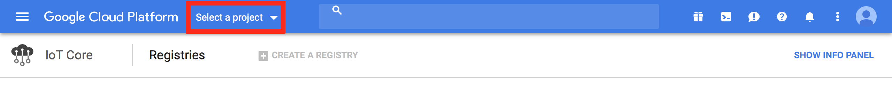

# Google IoT Core Examples #

This document describes the example applications provided with the [GoogleIoTCore library](../README.md).

## AutoRegister example ##

The example:
- Downloads public and private keys using the provided URLs.
- Registers a device (if not registered yet) in the Google IoT Core platform using the provided credentials and the public key.
- Connects to Google IoT Core using the private key and the provided credentials.
- Starts to send telemetry events every 8 sec. The events contain the current timestamp.

Source code: [AutoRegister.agent.nut](./AutoRegister.agent.nut)

See [AutoRegister Example Setup and Run](#autoregister-example-setup-and-run).

## ManualRegister Example ##

This example:
- Downloads a private key using the provided URL.
- Connects to Google IoT Core using the private key and the other provided credentials.
- Enables Configuration updates receiving.
- Receives and logs notifications when Configuration is updated.
- Sends the Configuration value as a device state.

Source code: [ManualRegister.agent.nut](./ManualRegister.agent.nut)

See [ManualRegister Example Setup and Run](#manualregister-example-setup-and-run).

## Example Setup and Run ##

### AutoRegister Example Setup and Run ###

1. [Login To Google IoT Core](#login-to-google-iot-core)

2. [Create IoT Core Project](#create-iot-core-project) (if not created yet)

3. [Create Device Registry](#create-device-registry)

4. [Set up your Imp device](https://developer.electricimp.com/gettingstarted)

5. In the [Electric Imp's IDE](https://impcentral.electricimp.com) create new Product and Development Device Group.

6. Assign a device to the newly created Device Group.

7. Copy the [AutoRegister example source code](./AutoRegister.agent.nut) and paste it into the IDE as the agent code.

8. Set constants in the agent example code:
 - *GOOGLE_IOT_CORE_PROJECT_ID*: example-project
 - *GOOGLE_IOT_CORE_CLOUD_REGION*: us-central1
 - *GOOGLE_IOT_CORE_REGISTRY_ID*: example-registry
 - *GOOGLE_IOT_CORE_DEVICE_ID*: example-device
 - Follow [these instructions](https://github.com/electricimp/OAuth-2.0/tree/master/examples#setting-up-google-oauth2-for-service-accounts) to set *GOOGLE_ISS* and *GOOGLE_SECRET_KEY* constants
 - *PUBLIC_KEY_URL*: TODO (temporary link: https://raw.githubusercontent.com/ragrus-nbl/GoogleIoTCore/master/pub_key.pem)
 - *PRIVATE_KEY_URL*: TODO (temporary link: https://raw.githubusercontent.com/ragrus-nbl/GoogleIoTCore/master/priv_key.pem)
 
 **Note**: You may use other names, ID's, etc. when following the instructions in Google IoT Console but make sure you set the constants in accordance to your data.

9. Click **Build and Force Restart**.

10. Check from the logs in the IDE that telemetry events are successfully sent from the device (periodically)

### ManualRegister Example Setup and Run ###

TODO

## Google IoT Core How To ##

### Login To Google IoT Core ###

Open [Google IoT Core](https://cloud.google.com/iot-core/) and click **Sign in**. Then log in.
If you are not registered, click **Create account** and follow the instructions.

After logging in click **VIEW CONSOLE** to open the IoT Core Console.

### Create IoT Core Project ###

1. In the [Azure portal](https://portal.azure.com/), click **Select a project > NEW PROJECT**:

**Note**: You may be needed to use a free trial period of paid subscription.

2. On the **New project** page, enter the following information for your new project:

 - **Project name**: example-project

 - **Billing account**: choose your billing account
 
 - Make a note of **your project ID**. It will be needed to setup and run your application.
 
 - Click **Create**

### Create Device Registry ###

1. On [this page](https://console.cloud.google.com/iot) choose your project and click **Enable API**:

2. Click **Create a device registry**:

3. Enter the following information for your new registry:

 - **Registry ID**: example-registry

 - **Region**: us-central1
 
 - **Default telemetry topic**: telemetry
 
 - **Default state topic**: state
 
 - Click **Create**
 

### Update Device Configuration ###

TODO
